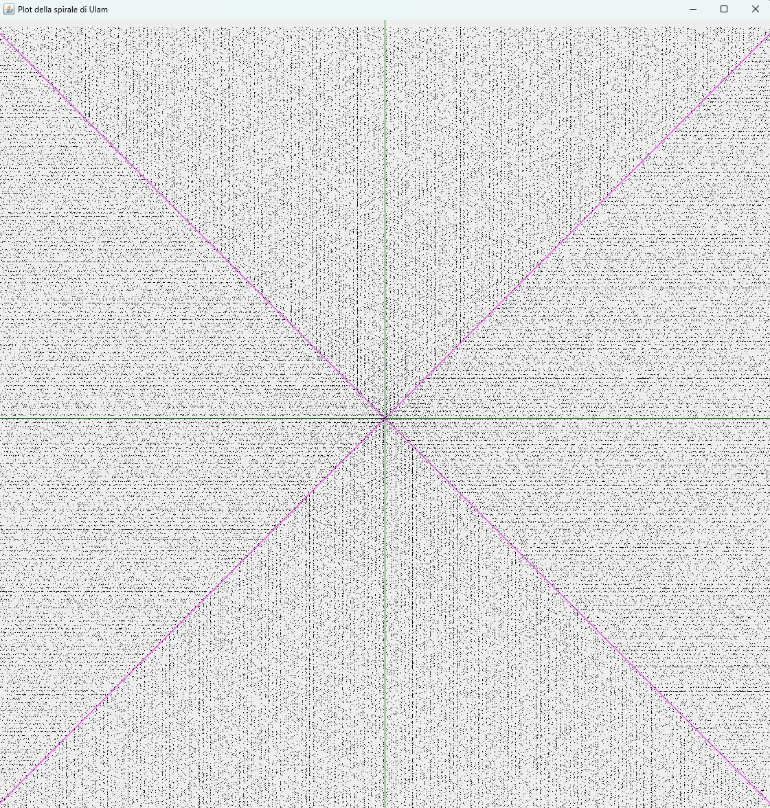
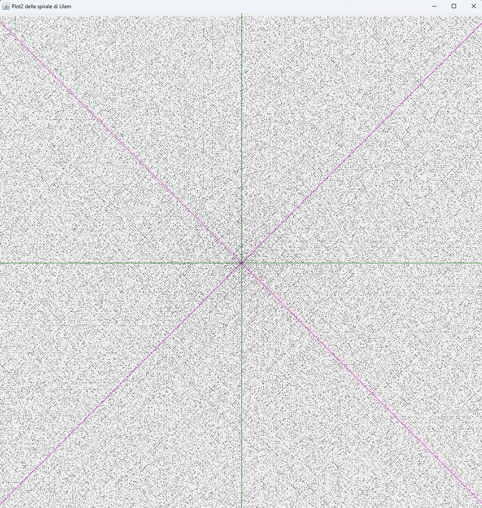

# spirulam
Progetto Eclipse (Version 2022-12 e Java 17) per la emissione (molto banale) della **spirale di Ulam** (sia diagonale che orizontale) su di un Java JPanel.

Il `main` da lanciare è 
	
	/spirulam/src/main/java/sm/clagenna/spirulam/awt/PlotUlam.java

La Spirale di Ulam ([vedi su Wikipedia](https://en.wikipedia.org/wiki/Ulam_spiral)) è una spirale di numeri interi positivi disposti nella seguente sequenza:

<table><tbody><tr><td style="text-align:right">...</td>
<td style="text-align:right">&nbsp;</td>
<td style="text-align:right">15</td>
<td style="text-align:right">←</td>
<td style="text-align:right">14</td>
<td style="text-align:right">←</td>
<td style="text-align:right">13</td>
</tr>
<tr>
<td style="text-align:right">&nbsp;</td>
<td style="text-align:right">&nbsp;</td>
<td style="text-align:right">&nbsp;</td>
<td style="text-align:right">&nbsp;</td>
<td style="text-align:right">&nbsp;</td>
<td style="text-align:right">&nbsp;</td>
<td style="text-align:right">↑</td>
</tr>
<tr>
<td style="text-align:right">5</td>
<td style="text-align:right">←</td>
<td style="text-align:right">4</td>
<td style="text-align:right">←</td>
<td style="text-align:right">3</td>
<td style="text-align:right">&nbsp;</td>
<td style="text-align:right">12</td>
</tr>
<tr>
<td style="text-align:right">↓</td>
<td style="text-align:right">&nbsp;</td>
<td style="text-align:right">&nbsp;</td>
<td style="text-align:right">&nbsp;</td>
<td style="text-align:right">↑</td>
<td style="text-align:right">&nbsp;</td>
<td style="text-align:right">↑</td>
</tr>
<tr>
<td style="text-align:right">6</td>
<td style="text-align:right">&nbsp;</td>
<td style="text-align:right">1</td>
<td style="text-align:right">→</td>
<td style="text-align:right">2</td>
<td style="text-align:right">&nbsp;</td>
<td style="text-align:right">11</td>
</tr>
<tr>
<td style="text-align:right">↓</td>
<td style="text-align:right">&nbsp;</td>
<td style="text-align:right">&nbsp;</td>
<td style="text-align:right">&nbsp;</td>
<td style="text-align:right">&nbsp;</td>
<td style="text-align:right">&nbsp;</td>
<td style="text-align:right">↑</td>
<td style="text-align:right">&nbsp;</td>
</tr>
<tr>
<td style="text-align:right">7</td>
<td style="text-align:right">→</td>
<td style="text-align:right">8</td>
<td style="text-align:right">→</td>
<td style="text-align:right">9</td>
<td style="text-align:right">→</td>
<td style="text-align:right">10</td>
</tr>
</tbody>
</table>

Sulla quale ogni numero primo è evidenziato
Sul JPanel ho disegnato un punto nero in corrispondenza di un **numero primo**

oppure 

oppure 

